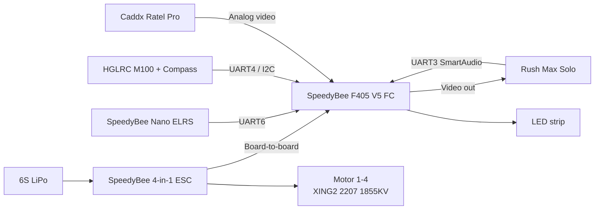

# Wiring — Dronii 5" Build

Flight controller: **SpeedyBee F405 V5** (STM32F405)
Firmware: **Betaflight 4.5.2**, target `SPEEDYBEEF405V5`

---

## Port assignments
 
Taken from the Betaflight Ports tab. Matches `betaflight-diff-all.txt`.
 
| Port | Device | Function | Baud | Protocol |
|---|---|---|---|---|
| USB VCP | — | Configuration/MSP | 115200 | MSP |
| UART1 | — | Unused | — | — |
| UART2 | — | Unused | — | — |
| UART3 | Rush Max Solo VTX | Peripheral | 115200 | TBS SmartAudio |
| UART4 | HGLRC M100 GPS | Sensor input | 57600 | UBLOX |
| UART5 | 4-in-1 ESC | Sensor input | 57600 | ESC telemetry |
| UART6 | SpeedyBee Nano ELRS | Serial RX | — | CRSF |

---

## Connections
 

 
---

## Physical wiring

| Device | FC pads | Termination | Wires |
|---|---|---|---|
| Caddx Ratel Pro camera | `CAM`, `5V`, `G` | JST plug at camera, soldered at FC | Video out / 4.5–27V / GND |
| ELRS receiver | `4V5`, `G`, `T6`, `R6` | Soldered on both ends | TX / RX / 5V / GND |
| GPS + compass | `4V5`, `G`, `T4`, `R4`, `SCL`, `SDA` | Plug at GPS, soldered at FC | RX / TX / SCL / SDA / 5V / GND |
| VTX | `VTX`, `T3`, `G`, `9V` | Plug at VTX, soldered at FC | SmartAudio / VIDEO IN / 9V / GND |
| Boozer | `B-`, `B+`, `G`, | Plug at Boozer, soldered at FC | + / − / GND |
| ESC | — | Board-to-board connector | Signal ×4 / telemetry / power |

---

## Power
 
| Rail | Source | Feeds |
|---|---|---|
| VBAT (6S) | Battery via ESC | FC input, motors |
| 9V | FC regulator | VTX |
| 5V | FC regulator | Camera |
| 4V5 | FC regulator | ELRS receiver, GPS + compass |
 
The buzzer runs off the dedicated `B+`/`B-` output, not off a shared rail.
 
**Note:** the VTX runs up to 2.5 W. Confirm the 9V rail's current rating covers it at full power before flying at max output.
 
---
 
## Configuration notes
 
- **Motor direction:** `yaw_motors_reversed = ON` — props-out configuration
- **Motor protocol:** DShot300 with bidirectional DShot (RPM telemetry over the signal wire — no extra wiring required)
- **VTX control:** SmartAudio over a single wire on UART3 TX; band/channel/power set from the OSD menu or via the `vtx` CLI entries
- **Compass:** shares the I2C bus with the GPS module; requires calibration after any change to the GPS mount position
---
 
## Assembly photos
 
Wiring, soldering, and finished build: [Google Drive album](https://drive.google.com/drive/folders/1DKZdByoKoDQ1DKYEFXLckaTX7_ePrfbe?usp=drive_link)
